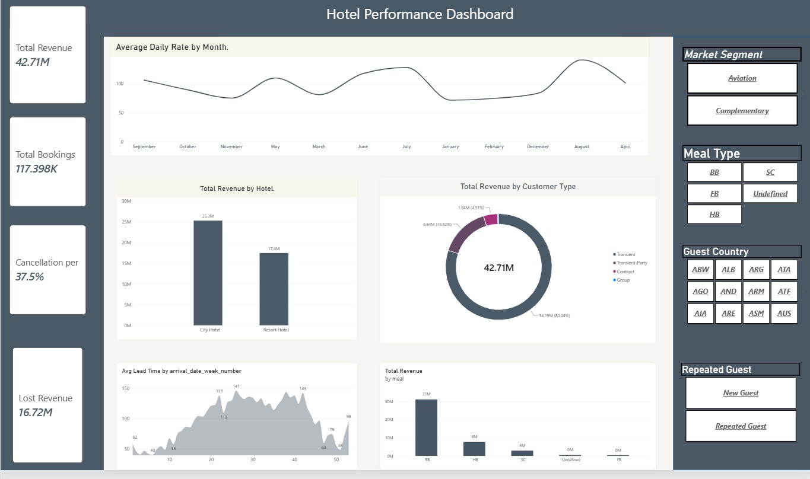
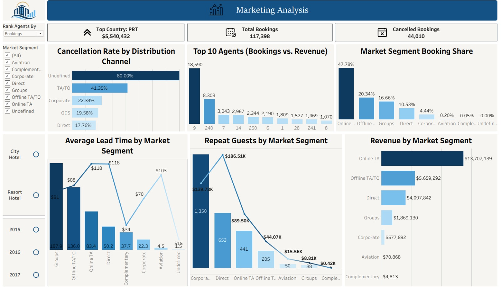
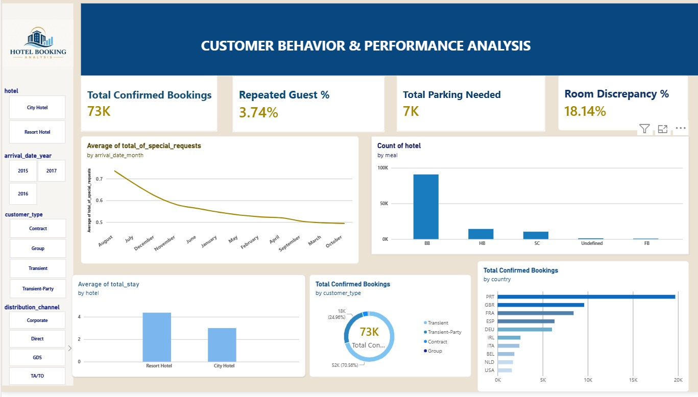
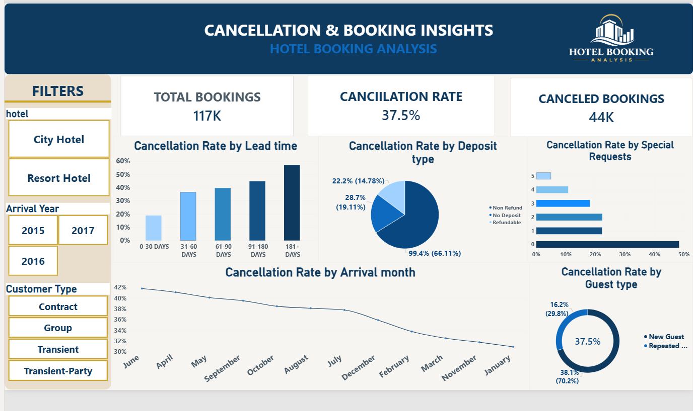

<p align="center">
  
</p>

<h1 align="center">Hotel Booking Analysis</h1>

<p align="center">
  An end-to-end data analysis project exploring booking, cancellation, revenue, and guest
  behavior for a City Hotel and a Resort Hotel using <b>Python</b>, <b>SQL</b>,
  <b>Power BI</b>, and <b>Tableau</b>.
</p>

---

## 📌 Overview

This project analyzes ~117K hotel booking records (2015–2017) to understand what drives
revenue, cancellations, and guest behavior across two hotel types. The workflow spans the
full pipeline: exploring and cleaning the raw data in Python, querying it with SQL to
answer specific business questions, and visualizing the results through four interactive
Power BI and Tableau dashboards.

## 🗂️ Repository Structure

```
Hotel-Booking-Analysis/
├── Data/
│   ├── hotel_booking.csv              # Raw booking dataset
│   ├── hotel_bookings_cleaned.csv     # Cleaned dataset used for analysis
│   └── data_PQ.xlsx                   # Power Query data-prep workbook
├── Py/
│   ├── final_poject.py                # Python EDA & data-cleaning script (pandas/seaborn)
│   └── *.jpeg                         # Charts generated by the script
├── Sql/
│   ├── 1_Revenue Query.sql            # Revenue, ADR, and lost-revenue queries
│   ├── 2_Market Query.sql             # Segment, channel, and agent performance queries
│   ├── 3_Cancellation Query.sql       # Cancellation-driver queries
│   └── 4_Customer Query.sql           # Guest behavior & demographics queries
├── Power Bi/
│   ├── revenue .pbix                  # Hotel Performance dashboard
│   ├── CUSTOMER BEHAVIOR.pbix         # Customer Behavior & Performance dashboard
│   ├── CANCELLATION & BOOKING.pbix    # Cancellation & Booking Insights dashboard
│   └── hotel.pbix                     # Combined overview dashboard
├── Tableau/
│   └── marketing.twbx                 # Marketing Analysis workbook (packaged, incl. data)
├── Img/                                # Logo and dashboard preview screenshots
├── Hotel Booking Analysis.pptx        # Project summary presentation
└── README.md
```

## 📊 Dataset

The data covers bookings for a **Resort Hotel** and a **City Hotel** between **2015 and
2017**, with 36 fields per booking, including:

- **Stay details** — lead time, arrival date, weekend/week nights, room type
- **Guest details** — adults, children, babies, repeat-guest flag, country
- **Booking behavior** — market segment, distribution channel, deposit type, booking changes
- **Financials** — average daily rate (ADR), agent/company, special requests
- **Outcome** — cancellation status and reservation status date

`hotel_bookings_cleaned.csv` is the analysis-ready version: personally identifiable
fields (name, email, phone number, credit card) were removed, duplicates/nulls handled,
and derived fields added (`total_stay`, `total_guests`, `reservation_year`,
`reservation_month`, `room_type_changed`). `data_PQ.xlsx` holds the Power Query
transformations used to prep the data for Power BI.

## 🔍 Key Insights

- **117,398** bookings analyzed after cleaning, split between **City Hotel** (~78K) and
  **Resort Hotel** (~39K) — City Hotel accounts for roughly two-thirds of all bookings.
- **37.5% overall cancellation rate** (~44K bookings), making cancellations one of the
  biggest levers on realized revenue (**$16.72M in lost revenue**).
- Cancellation risk climbs sharply with **lead time** and is far higher for
  **non-refundable deposits** and **new (non-repeat) guests**.
- **Portugal (PRT)** is by far the largest source market, followed by the **UK, France,
  Spain, and Germany**; **Online TA** is the leading distribution channel (~48% of bookings).
- Revenue, ADR, and lead time vary meaningfully **by market segment and distribution
  channel**, highlighting which channels bring in higher-value, lower-risk bookings.

## 🛠️ Analysis Components

### Python EDA (`/Py`)
`final_poject.py` loads the raw data, handles missing values and duplicates (dropping
`company`, imputing `agent`/`country`/`children`), and produces exploratory charts
covering: overall reservation status, cancellations by hotel type, lead-time
distribution by cancellation status, monthly booking trends, ADR by cancellation
status, cancellation rate by room-change status, cancellations by market segment, and
a correlation matrix of key numerical features. The generated charts are saved
alongside the script as `.jpeg` files.

### SQL (`/Sql`)
- **`1_Revenue Query.sql`** — total/lost revenue by hotel, average daily rate by month,
  revenue by meal plan and market segment, and top revenue-generating countries.
- **`2_Market Query.sql`** — top countries and market segments by revenue, market
  segment booking share, cancellation rate by distribution channel, top-performing
  agents, repeat-guest behavior, and average lead time by segment.
- **`3_Cancellation Query.sql`** — cancellation rate by lead-time bucket, deposit type,
  room-type change, arrival month, special requests, prior cancellation history, and
  booking changes.
- **`4_Customer Query.sql`** — guest demographics (solo/couples/families/groups),
  length of stay, meal and room-type preferences, parking demand, special requests,
  room discrepancy rate, and channel mix for repeat guests.

### Power BI (`/Power Bi`)
Four dashboards, each built around one of the SQL query sets: **Hotel Performance**
(`revenue .pbix`), **Customer Behavior & Performance** (`CUSTOMER BEHAVIOR.pbix`),
**Cancellation & Booking Insights** (`CANCELLATION & BOOKING.pbix`), and a combined
overview (`hotel.pbix`).

### Tableau (`/Tableau`)
`marketing.twbx` — a packaged workbook (data included) focused on marketing-side
metrics: segment performance, channel mix, agent rankings, and booking share.

## 📸 Dashboard Previews

### Hotel Performance Dashboard (Power BI)


High-level financial view of the business: **$42.71M total revenue**, **117,398 total
bookings**, a **37.5% cancellation rate**, and **$16.72M in lost revenue** from
cancellations. Includes average daily rate by month, revenue split by hotel (City
$25.3M vs. Resort $17.4M) and by customer type, average lead time by week number, and
revenue by meal plan — with slicers for market segment, meal type, guest country, and
repeat-guest status.

### Marketing Analysis (Tableau)


Marketing and channel-performance view: top country by revenue (**Portugal,
$5.54M**), cancellation rate by distribution channel, the top 10 booking agents by
volume vs. revenue, market segment booking share (**Online TA leads at 47.78%**),
average lead time by market segment, repeat guests by segment, and total revenue by
market segment — filterable by hotel type, year, and agent ranking.

### Customer Behavior & Performance Analysis (Power BI)


Guest-behavior focused view: **73K confirmed bookings**, a **3.74% repeat-guest
rate**, **7K bookings needing parking**, and an **18.14% room-discrepancy rate**
(assigned room type differing from what was reserved). Also breaks down special
requests by month, meal preference (BB is dominant), average length of stay by hotel,
bookings by customer type, and bookings by guest country — with slicers for hotel,
arrival year, customer type, and distribution channel.

### Cancellation & Booking Insights (Power BI)


Deep dive into *why* bookings are cancelled: of **117K total bookings**, **44K (37.5%)**
were cancelled. Cancellation rate climbs sharply with lead time (from ~8% for 0–30
day bookings to over 50% for stays booked 181+ days out), is highest for
**non-refundable deposits** (99.4% of cancellations), drops as arrival month moves
from June toward January, and is higher among **new guests (70.2%)** than repeat
guests. Filterable by hotel, arrival year, and customer type.

## 🧰 Tools Used

| Tool | Purpose |
|------|---------|
| Python (pandas, seaborn, matplotlib) | Data cleaning and exploratory analysis |
| SQL (T-SQL) | Data querying and business-question answering |
| Power BI | Interactive dashboarding (4 dashboards) |
| Tableau | Marketing-focused visualization |
| Excel (Power Query) | Data prep / transformation |
| PowerPoint | Project summary presentation |

## 🚀 Getting Started

1. Clone the repo:
   ```bash
   git clone https://github.com/Nofal91/Hotel-Booking-Analysis.git
   ```
2. (Optional) Run `Py/final_poject.py` to reproduce the cleaning steps and EDA charts
   from the raw `hotel_booking.csv`.
3. Load `Data/hotel_bookings_cleaned.csv` into your SQL environment (matching the
   table/database names referenced at the top of each script) and run the queries in
   `/Sql`, in order (`1_Revenue Query.sql` → `4_Customer Query.sql`).
4. Open any of the `.pbix` files in `Power Bi/` with Power BI Desktop, or
   `Tableau/marketing.twbx` in Tableau, to explore the dashboards interactively.
5. See `Hotel Booking Analysis.pptx` for a summarized walkthrough of the findings.

## 👤 Author

**Nofal91** — [github.com/Nofal91](https://github.com/Nofal91)

---
<p align="center"><i>Feel free to fork, explore, and reach out with questions or suggestions.</i></p>
